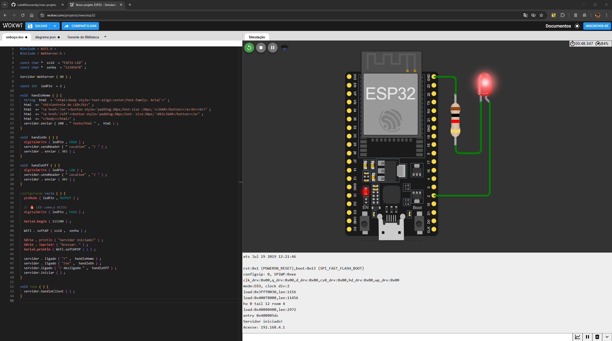

# Projeto ESP32 – Controle de LED via Servidor Web (Simulação Wokwi)

Este projeto demonstra como utilizar o **ESP32** para criar um **servidor web** capaz de **ligar e desligar um LED**.  
O código foi desenvolvido e testado na plataforma de simulação **Wokwi**.

---

## 📌 Funcionalidades
- Criação de um **Access Point (Wi-Fi próprio)** pelo ESP32.  
- Servidor Web que disponibiliza uma página com botões:
  - **Ligar LED**
  - **Desligar LED**
- LED inicia **aceso** ao ligar o ESP32.
- Interface simples em HTML.

---

## 🖼️ Simulação do Circuito



---

## 📁 Arquivos do Projeto

- `sketch.ino` → Código-fonte do ESP32.  
- `assets/` → Pasta contendo imagens utilizadas no README.  

---

## 🧠 Código utilizado

```cpp
#include <WiFi.h>
#include <WebServer.h>

const char* ssid = "ESP32-LED";
const char* password = "12345678";

WebServer server(80);

const int ledPin = 2;

void handleHome() {
  String html = "<html><body style='text-align:center;font-family:Arial'>";
  html += "<h1>Controle do LED</h1>";
  html += "<a href='/on'><button style='padding:20px;font-size:20px;'>LIGAR</button></a><br><br>";
  html += "<a href='/off'><button style='padding:20px;font-size:20px;'>DESLIGAR</button></a>";
  html += "</body></html>";
  server.send(200, "text/html", html);
}

void handleOn() {
  digitalWrite(ledPin, HIGH);  
  server.sendHeader("Location", "/");
  server.send(303);
}

void handleOff() {
  digitalWrite(ledPin, LOW);
  server.sendHeader("Location", "/");
  server.send(303);
}

void setup() {
  pinMode(ledPin, OUTPUT);

  digitalWrite(ledPin, HIGH);

  Serial.begin(115200);

  WiFi.softAP(ssid, password);

  Serial.println("Servidor iniciado!");
  Serial.print("Acesse: ");
  Serial.println(WiFi.softAPIP());

  server.on("/", handleHome);
  server.on("/on", handleOn);
  server.on("/off", handleOff);
  server.begin();
}

void loop() {
  server.handleClient();
}
